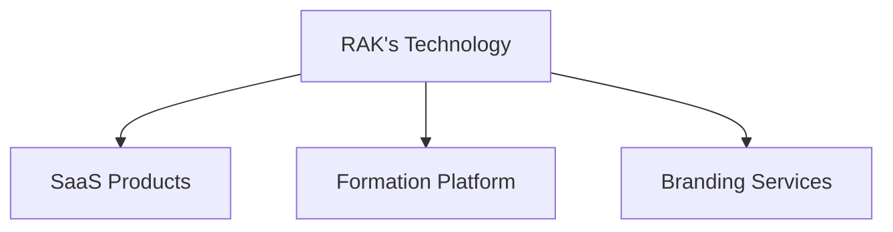

# 🚀 RAK's Technology  
### *Revolutionary Agile Koders*

  
  
  

  
  
  

> **« Une solution, des milliers d'impacts. »**

Nous concevons des **écosystèmes digitaux simples, accessibles et puissants** pour moderniser les organisations en Afrique.

---

##  Qui sommes-nous ?

**RAK's Technology** est une startup technologique de type **SaaS Builder**.

Contrairement aux agences classiques :
- ❌ Pas de simples sites vitrines
- ❌ Pas de prestations ponctuelles
- ✅ Nous créons **nos propres solutions logicielles**
- ✅ Nous bâtissons des **produits scalables et durables**

---

## Nos Offres

###  1. Offre Logicielle (SaaS)

>  **Cœur de notre activité**

Le modèle **SaaS (Software as a Service)** permet à nos clients d’utiliser nos solutions directement via Internet.

* ** Avantages :**
  -  Accès cloud (partout, tout le temps)
  -  Mises à jour continues
  -  Sécurité & sauvegardes
  -  Zéro installation
  -  Support inclus
* ** Modèle économique :** Abonnement mensuel, annuel, ou commission sur les transactions.

###  2. Offre de Formation

Nous proposons une plateforme dédiée à l'apprentissage et la montée en compétences :

-  Diffusion de formations de haute qualité.
-  Collaboration et échanges avec d'autres entreprises.
-  Promotion & visibilité des programmes.

💡 *RAK's Technology agit également comme un amplificateur marketing pour les formations externes.*

###  3. Branding & Identité Visuelle

Nous aidons les entreprises à construire une **image forte et cohérente** indispensable dans le monde digital d'aujourd'hui :

-  Création de logos marquants.
-  Élaboration de palettes de couleurs stratégiques.
-  Conception d'identités visuelles complètes.
-  Design moderne, ergonomique et impactant (UI/UX).

---

## 🧩 Notre Approche

### 🎯 Focus Strategy

> **Une seule priorité à la fois = performance maximale**

- 🚫 **Pas de dispersion :** Nous restons concentrés.
- 🔥 **Concentration totale :** Un produit à la fois pour un maximum de valeur.
- ⚡ **Développement rapide :** Méthodologie Agile.
- 🏆 **Qualité supérieure :** Excellence technique garantie.

---

## 🏗️ Architecture de l’entreprise

---

## 👥 Équipe

Notre force réside dans notre diversité et notre expertise :

* **🎨 Design & Création :** UX/UI Designers, Graphistes, Créateurs de contenu.
* **💻 Tech Team :** Fullstack Developers, Frontend Engineers, Backend Engineers, AI / ML Enthusiasts.

---

## 📊 Stats & Activité

  

  

---

## 🚀 Roadmap

- [ ] **Structuration de la startup :** Consolidation des bases.
- [ ] **Définition du modèle SaaS :** Étude de marché et validation.
- [ ] **Lancement du premier produit :** Go-to-market.
- [ ] **Expansion de la plateforme de formation :** Ajout de nouveaux parcours.
- [ ] **Déploiement à l’échelle africaine :** Impact continental.

---

## 🤝 Collaboration

Nous sommes toujours ouverts aux opportunités :

- 🤝 **Partenariats stratégiques**
- 🎓 **Collaboration avec des entreprises de formation**
- 💼 **Investisseurs & mentors**
- 💻 **Développeurs passionnés**

---

## 📬 Contact & Support

📧 **Email :** [shaidmasad10@gmail.com](mailto:shaidmasad10gmail.com)

---

### ⚡ Fun Fact
*Nous ne construisons pas juste du code… Nous construisons des systèmes qui transforment des communautés.*

⭐ **Si vous aimez notre vision, n'oubliez pas de mettre une étoile (star) à notre repo !** ⭐

